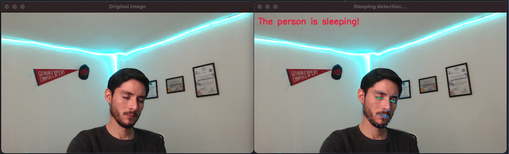

# Eye blinks detector 👁

<!-- Project description -->
This repository estimates facial landmarks to identify if a person blinks or if the person is sleeping.

<center>
    
</center>

## Prerequisities

Before you begin, ensure you have met the following requirements:

* You have a _Windows/Linux/Mac_ machine running [Python 3.6+](https://www.python.org/).
* You have installed the latest versions of [`pip`](https://pip.pypa.io/en/stable/installing/) and [`virtualenv`](https://virtualenv.pypa.io/en/stable/installation/) or `conda` ([Anaconda](https://www.anaconda.com/distribution/)).


## Setup

To install the dependencies, you can simply follow this steps.

Clone the project repository:
```bash
git clone https://github.com/RodolfoFerro/eye-blink.git
cd eye-blink
```

To create and activate the virtual environment, follow these steps:

**Using `conda`**

```bash
$ conda create -n eye-blink python=3.7

# Activate the virtual environment:
$ conda activate eye-blink

# To deactivate (when you're done):
(eye-blink)$ conda deactivate
```

**Using `virtualenv`**

```bash
# In this case I'm supposing that your latest python3 version is 3.6+
$ virtualenv eye-blink --python=python3

# Activate the virtual environment:
$ source eye-blink/bin/activate

# To deactivate (when you're done):
(eye-blink)$ deactivate
```

To install the requirements using `pip`, once the virtual environment is active:
```bash
(eye-blink)$ pip install -r requirements.txt
```

#### Running the script

Finally, if you want to run the main script:
```bash
$ python main.py
```

This will start your camera and open a window with the output.

#### Modify parameters

If you want to change the parameters of the blink detector, you can directly modify the specs from the `tools/config.py` script.
